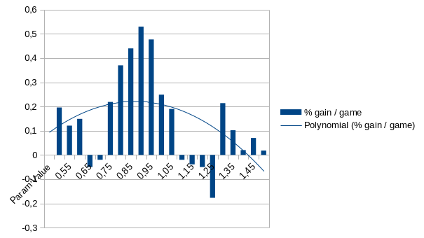
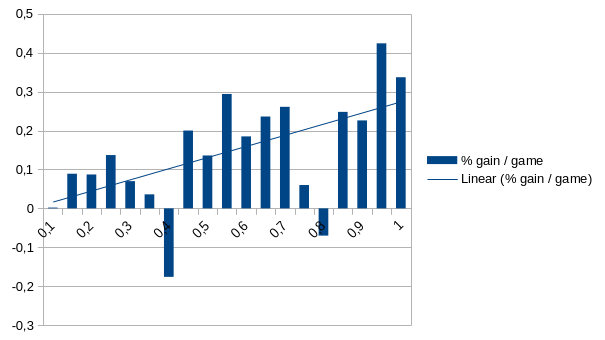
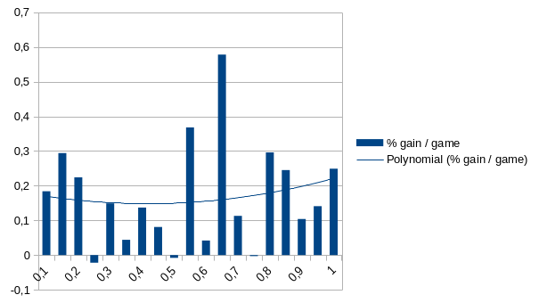
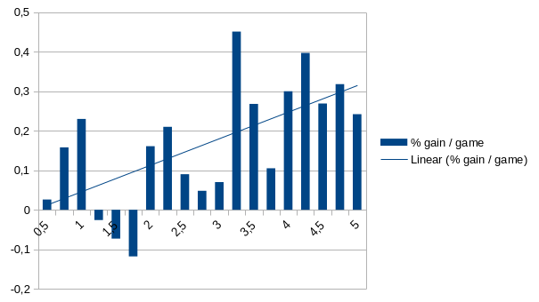
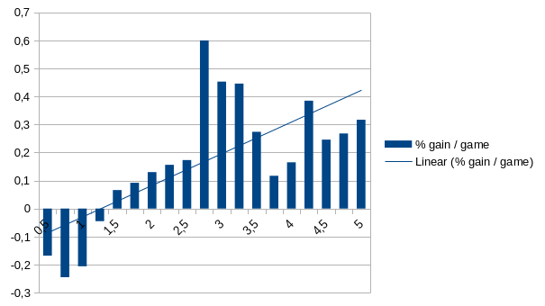
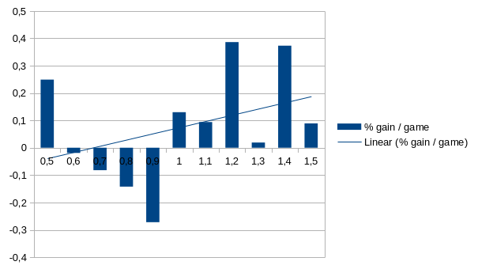
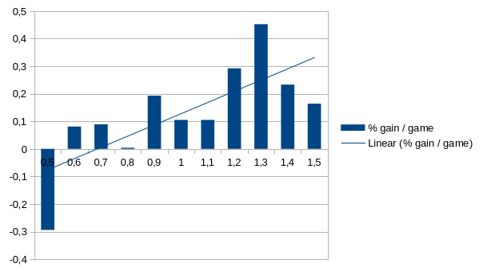
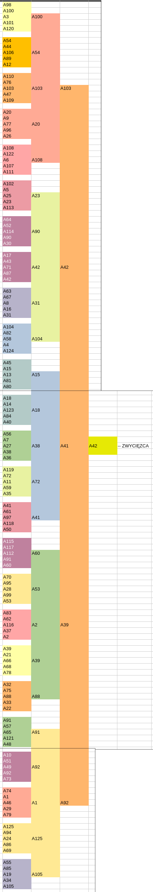

# Raport z testów różnych agentów

## Testowanie

Testowanie przebiegało w następujący sposób:

Zmieniałem po kolei parametry agentów o małe wartości. Każdy z nich był testowany przy pomocy uruchomienia `./bot -b steps.params`. Ten tryb wykonał 300 gier (standardowy five-card draw poker z ante) dla każdej z nich przeciwko 4 botom - zachowawczym, normalnym, agresywnym i agresywnym-podbijającym. Najsilniejszy z nich (czterech) był agresywny, a podbijający czasem wygrywał pojedyncze mecze z dużymi stawkami, gdy mu się poszczęściło.

## Podstawowe wartości parametrów

Podstawowe wartości parametrów, które były tak ustawione, gdy jeden z parametrów ulegał zmianie:

- **Exploration Constant**: 1.0
- **Draw Bias (low)**: 0.55
- **Draw Bias (high)**: 0.55
- **Call Bias**: 2.75
- **Raise Bias**: 2.75
- **Hand Strength Weight**: 1.0
- **Bankroll Weight**: 1.0
- **Hand Weights**: 
  - HIGH_CARD 0.1
  - PAIR 0.2
  - TWO_PAIR 0.4
  - THREE_KIND 0.6
  - STRAIGHT 0.8
  - FLUSH 1.0
  - FULL_HOUSE 1.2
  - FOUR_KIND 1.4
  - STRAIGHT_FLUSH 1.6
  - ROYAL_FLUSH 2.0

Parametry te są opisane w pliku `README.md`.

## Zmiany w parametrach i ich zakresy

### Exploration Constant (0.5 - 1.5, 0.1 inc)

Wykres przyjmuje trend odwróconego U. Dzieje się tak, ponieważ wartości bliskie 1 dają dobry balans pomiędzy eksploracją a rozwijaniem już znanych węzłów. Widzimy także duże wachania przy wyższych wartościach, zapewne wynika to z tego, że przypada wtedy mniej symulacji na węzeł, więc wyniki są mniej miarodajne.

### Draw Bias (low) (0.1 - 1.0, 0.05 inc)

Wykres ma trend wzrostowy. Wymiana kart, gdy mamy co najwyżej parę, jest praktycznie zawsze opłacalna, a MCTS wybiera, które karty chce wymienić.

### Draw Bias (high) (0.1 - 1.0, 0.05 inc)

Wykres nie przyjmuje żadnego trendu lub przyjmuje U. Wymiana kart, gdy mamy silniejsze ręce, wiąże się z większym ryzykiem. Możliwe, że ilość testów była za mała, aby otrzymać bardziej miarodajne wyniki. Spodziewałem się, że trend będzie spadkowy.

### Call Bias (0.5 - 5.0, 0.25 inc)

Wykres przyjmuje trend wzrostowy. Można było się tego spodziewać, gdyż spasowanie na start oznacza stratę, więc agresywność jest dodatkowo nagradzana. Wachania przy niższych wartościach zapewne wynikają z tego, że czasem nie trafiała się dobra ręka, aby mógł obstawić.

### Raise Bias (0.5 - 5.0, 0.25 inc)

Wykres również przyjmuje, tym razem bardziej wyraźny, trend wzrostowy. Pewność siebie daje botom dodatkową szansę na zarobek. Jeśli więcej calli jest zamieniane na raisy, boty są w stanie zazwyczaj bezboleśnie (jeśli mają odpowiednio silną rękę) wyciągnąć bonus.

### Hand Strength Weight (0.5 - 1.5, 0.1 inc)

Tutaj trend jest wzrostowy, bądź wykres jest losowy. Na dobrą sprawę ta zmienna wydaje mi się bezużyteczna, ponieważ możemy bezpośrednio edytować wartości dla danych rąk, a samo mnożenie ich wszystkich zarazem, dopóki są odpowiednio dobrane, nie robi większego znaczenia.

### Bankroll Weight (0.5 - 1.5, 0.1 inc)

Nazwa trochę nieadekwatna, a mianowicie wartość mówi nam, jak bardzo bot jest skłonny do dalszego callowania/raisowania w zależności od tego, ile obstawił, a nie tego, ile ogólnie jest na +. Wykres ma trend wzrostowy, gdyż wysokie wartości sprawiają, że bot nie odpuszcza po obstawieniu dużej kwoty. Natomiast dawało to szansę agresywnemu-podbijającemu botowi na niektóre szczęśliwe wygrane, gdy nasz bot za bardzo sugerował się tym, ile już obstawił. Sprawiało to również, że dużo gier między botami z wysoką wartością kończyło się na maksymalnym becie.

## Podsumowanie

Boty grały zazwyczaj lepiej, będąc bardziej agresywnymi, co wymuszało na nich ante. Bez tego zapewne bardziej cenione (na dużej liczbie próbek) byłoby granie zachowawcze, gdyż mogłyby one czekać na odpowiedni moment i minimalizować straty. Byłoby to jednak zarazem nudne, a w sytuacjach, gdy dużo takich botów byłoby zestawionych ze sobą, nie aż tak opłacalne, gdyż wymagałoby dużo czasu. Nawet jeśli bot miałby dobrą rękę, to inne mogłyby nie obstawić.

## Turniej

Następnym etapem testowania było wyłonienie najlepszych zestawów parametrów w turnieju (125 złożonych z najlepszych wartości z poprzedniej części, rywalizujące w losowej drabince po 5 graczy na mecz, 50 gier na szczebel).

Wyniki turnieju są widoczne na poniższym screenie (przepisywałem je ręcznie do arkusza):

Wszystkie parametry zapisane są w pliku `tournament.params`, a najlepsze z nich w `best.params`.

Co ciekawe, wartości benchmarku dla nich wyszły następujące:
- **A103**: 0.525
- **A42**: 0.431
- **A41**: 0.422
- **A39**: 0.317
- **A92**: 0.389

Wynik ponad 0.5% na grę jest naprawdę dobry. Bot na 100 gier jest w stanie zyskać 50% swojego początkowego kapitału przy jednocześnie niedużym ryzyku na grę. Natomiast widzimy też, że w turnieju najlepiej wypadł bot, który miał 3. najlepszą wartość. Wydaje mi się, że różnice w ich zachowaniach nie były aż tak istotne (były złożeniami lepszych wartości, a przez to głównie z jednej strony przedziałów), a przeciwnicy różni od tych uproszczonych z benchmarku, aby te wartości miały duże znaczenie. Natomiast zastanawiający jest wynik bota A39, gdyż jest on dosyć niski, jednak mogła być to tylko kwestia braku szczęścia.

Był to zdecydowanie ciekawy eksperyment. Nie sądziłem, że bot do tak losowej gry może okazać się na dłuższą metę zdolny do wygrywania, nawet grając przeciwko innym zaawansowanym botom. Ukazał on również, jak niektóre zachowania zostają wymuszone poprzez charakter rozgrywki, jak np. agresywna gra przez nieuniknioną stratę w przypadku powstrzymywania się.

